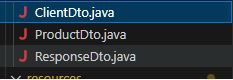

#Unidad 7 Actividad complementaria 1

**Matías Alejandro Suárez Zúñiga
422151458**

###a)	Investiga ¿qué es un API? y ¿qué es un microservicio?
La Interfaz de Programación de Aplicaciones por sus siglas en inglés (Application Programming Interface), es un conjunto de reglas y definiciones que sirven como puente  entre diferentes aplicaciones, facilitando la comunicación y el intercambio de datos de manera estructurada.

Los microservicios por su parte son un enfoque arquitectónico y organiztivo que se basa en el uso de varios servicios pequeños y especializados que se comunican a través APIs bien definidas.  

**b)	Investiga qué es Swagger y ¿para qué se utiliza?**
Es un conjunto de herramientas que sirve para diseñar, construir, documentar y consumir servicios web de una manera más fácil. Su función principal es ayudar en la creación y documentación de APIs (Interfaces de Programación de Aplicaciones).

###c) Descarga el proyecto del API que se encuentra en GitHub. En el foro se indicará la dirección de GitHub.
###d) Completa los endpoints que faltan.
 **Ejecuta el endpoint GET /products/all. ¿Qué devuelve y en qué formato?**
Devuelve todos los productos en formato JSON:

 

###d) Crea el endpoint /clients/all que muestre todos los clientes. Deberás tomar como referencia el endpoint GET /products/all. Para ello deberás:
###d.1) Crear el archivo ClientDto.java en la carpeta dto.

 
 
###d.2) Modificar el archivo StoreDao.java para incluir el nuevo query getClients(). Deberás mapear ClienteDto de manera similar a:
**@RegisterBeanMapper(ProductDto.class)
@SqlQuery("SELECT * FROM productos")
List<ProductDto> getProducts();**

 
 
###d.3) Deberás modificar el archivo StoreDal.java y crear el método getClients()

  

  
###d.4) Deberás crear el archivo ClientsResource.java en la carpeta src/main/java/resources junto a ProductsResources.java El archivo ClientsResource.java deberá contener un método getClients():

  

  
###e) Ejecuta el proyecto.

  

 

